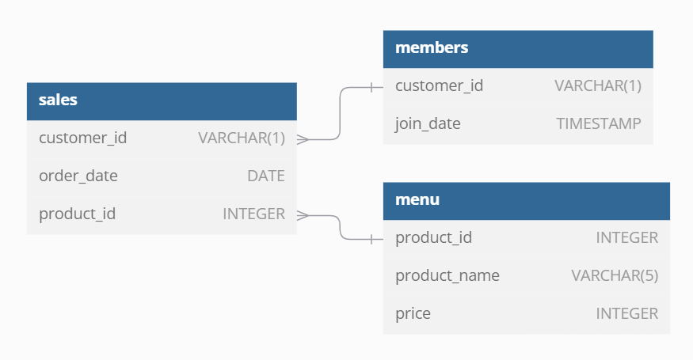
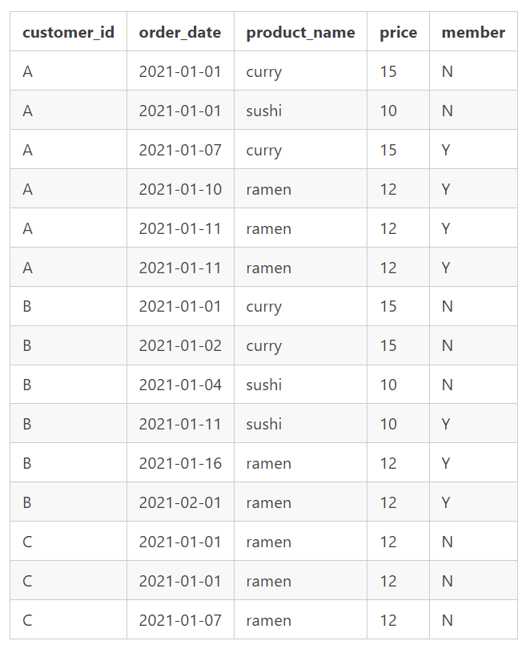

# Danny's diner Case


## Quick link: [Queries Script](dannys_diner.sql)

## ER-Diagram


## Case Study Questions
Each of the following case study questions can be answered using a single SQL statement:

1. What is the total amount each customer spent at the restaurant?
```sql
SELECT 
	s.customer_id AS customer
    , SUM(men.price) total_spend
FROM sales AS s
    JOIN menu AS men ON men.product_id = s.product_id
GROUP BY
    customer;
```
```sql
+-----------+-------------+
| Customer  | Total Spend |
+-----------+-------------+
| A         |          76 |
+-----------+-------------+
| B         |          74 |
+-----------+-------------+
| C         |          36 |
+-----------+-------------+
```

2. How many days has each customer visited the restaurant?

```sql
SELECT
	customer_id AS customer
    , COUNT(DISTINCT order_date) AS visits
FROM 
	sales AS s
	JOIN menu AS m ON s.product_id = m.product_id
GROUP BY
		customer
;
```
```sql
+-----------+--------+
| Customer  | Visits |
+-----------+--------+
| A         |      4 |
+-----------+--------+
| B         |      6 |
+-----------+--------+
| C         |      2 |
+-----------+--------+
```
3. What was the first item from the menu purchased by each customer?
```sql
WITH CTE AS (
  SELECT
    customer_id
    , order_date
    , product_name
    , RANK() OVER( PARTITION BY customer_id ORDER BY order_date) AS rnk
    , ROW_NUMBER() OVER( PARTITION BY customer_id ORDER BY order_date ASC) AS rn
  FROM
	sales AS s
    INNER JOIN menu AS m ON s.product_id = m.product_id
)
SELECT
  customer_id
  , product_name
FROM
  CTE
WHERE
  rnk = 1
;
```
```sql
+-------------+--------------+
| Customer ID | Product Name |
+-------------+--------------+
| A           | Sushi        |
+-------------+--------------+
| A           | Curry        |
+-------------+--------------+
| B           | Curry        |
+-------------+--------------+
| C           | Ramen        |
+-------------+--------------+
| C           | Ramen        |
+-------------+--------------+
```
4. What is the most purchased item on the menu and how many times was it purchased by all customers?
```sq
SELECT 
  m.product_name AS item
  , COUNT(s.order_date) AS total_purchases
FROM menu AS m 
  JOIN sales AS s ON s.product_id = m.product_id
GROUP BY 
  item
ORDER BY 
  total_purchases DESC
LIMIT 1    
;
```
```sql
+------+----------------+
| Item | Total Purchases |
+------+----------------+
| Ramen|               8 |
+------+----------------+
```
5. Which item was the most popular for each customer?
```sql
WITH CTE AS (
SELECT 
  s.customer_id AS customer
  , m.product_name AS item
  , COUNT(s.order_date) AS total_purchases
  , RANK() OVER( PARTITION BY customer_id ORDER BY COUNT(s.order_date) DESC) AS rnk
  , ROW_NUMBER() OVER( PARTITION BY customer_id ORDER BY COUNT(s.order_date) DESC) AS rn
FROM menu AS m 
  JOIN sales AS s ON s.product_id = m.product_id
GROUP BY
  item
  , customer
)
SELECT
  customer
  , item
FROM 
  CTE
WHERE
  rnk = 1
;
```
```sql
+-----------+-------+
| customer  | item  |
+-----------+-------+
| A         | ramen |
| B         | curry |
| B         | sushi |
| B         | ramen |
| C         | ramen |
+-----------+-------+
```
6. Which item was purchased first by the customer after they became a member?

```sql
WITH CTE AS (
SELECT 
 s.order_date AS purchase
 , join_date
 , m.product_name AS item
 , s.customer_id AS customer
 , RANK() OVER( PARTITION BY s.customer_id ORDER BY s.order_date ASC) AS rnk
 , ROW_NUMBER() OVER( PARTITION BY s.customer_id ORDER BY s.order_date ASC) AS rn 
FROM
  menu AS m
  JOIN sales AS s ON s.product_id = m.product_id
  JOIN members AS me ON s.customer_id = me.customer_id
WHERE 
  s.order_date >= me.join_date
)
SELECT
  item
  , customer
FROM 
  CTE
WHERE
  rnk = 1
;
```
```sql
+-------+-----------+
| item  | customer  |
+-------+-----------+
| curry |     A     |
+-------+-----------+
| sushi |     B     |
+-------+-----------+
```

7. Which item was purchased just before the customer became a member?
```sql
WITH CTE AS (
  SELECT 
    s.order_date AS purchase
    , join_date
    , m.product_name AS item
    , s.customer_id AS customer
    , RANK() OVER( PARTITION BY s.customer_id ORDER BY s.order_date DESC) AS rnk
    , ROW_NUMBER() OVER( PARTITION BY s.customer_id ORDER BY s.order_date DESC) AS rn 
  FROM
    menu AS m
    JOIN sales AS s ON s.product_id = m.product_id
    JOIN members AS me ON s.customer_id = me.customer_id
  WHERE 
    s.order_date < me.join_date
)
SELECT
  item
  , customer
FROM 
  CTE
WHERE
  rnk = 1
;
```
```sql
+-------+-----------+
| item  | customer  |
+-------+-----------+
| sushi |     A     |
+-------+-----------+
| curry |     A     |
+-------+-----------+
| curry |     B     |
+-------+-----------+

```
8. What is the total items and amount spent for each member before they became a member?
```sql
SELECT 
	COUNT(m.product_name) AS total_items,
    s.customer_id AS customer
   , SUM(m.price) AS amount_spent
FROM
    menu AS m
    JOIN sales AS s ON s.product_id = m.product_id
    JOIN members AS me ON s.customer_id = me.customer_id
WHERE
	s.order_date < me.join_date
GROUP BY
	customer
ORDER BY 
	customer,
    amount_spent
;
```
```sql
+-------------+-----------+--------------+
| total_items | customer  | amount_spent |
+-------------+-----------+--------------+
|      2      |     A     |      25      |
+-------------+-----------+--------------+
|      3      |     B     |      40      |
+-------------+-----------+--------------+
```
9.  If each $1 spent equates to 10 points and sushi has a 2x points multiplier - how many points would each customer have?
```sql
SELECT
	customer
    , SUM(points) AS total_points
FROM 
  (SELECT
     s.customer_id AS customer,
	 m.product_name,
     m.price,
   CASE 
	WHEN m.product_name = 'sushi' THEN m.price * 20
    ELSE m.price * 10
    END AS points
  FROM 
  sales s 
  JOIN menu m ON s.product_id = m.product_id
  ) AS subquery 
GROUP BY
  customer
;
```
Alternative way of writing the query is:
```sql
SELECT
   s.customer_id AS customer
   , SUM(CASE 
	     WHEN m.product_name = 'sushi' THEN m.price * 20
         ELSE m.price * 10
         END
         ) AS points
FROM 
  sales s 
  JOIN menu m ON s.product_id = m.product_id
GROUP BY
  customer
;
```
```sql
+-------------+--------+
| customer_id | points |
+-------------+--------+
|     A       |   860  |
+-------------+--------+
|     B       |   940  |
+-------------+--------+
|     C       |   360  |
+-------------+--------+
```
10. In the first week after a customer joins the program (including their join date) they earn 2x points on all items, not just sushi - how many points do customer A and B have at the end of January?
```sql
SELECT
   s.customer_id AS customer
   , SUM(
	   CASE 
		 WHEN s.order_date BETWEEN mem.join_date AND mem.join_date + 6 THEN price * 10 * 2
         WHEN product_name = 'sushi' THEN price * 10 * 2 
		 ELSE m.price * 10
         END) AS points
FROM 
  sales s 
  JOIN menu m ON s.product_id = m.product_id
  JOIN members AS mem ON s.customer_id = mem.customer_id
WHERE 
   s.order_date BETWEEN '2021-01-01' AND '2021-01-31' -- filter only january
   AND s.customer_id IN ('A', 'B')
GROUP BY
customer
;
```
```sql
+----------+-------+
| customer | points|
+----------+-------+
|    A     |  1370 |
+----------+-------+
|    B     |  820  |
+----------+-------+
```
Bonus question. Join all the things

The following questions are related creating basic data tables that Danny and his team can use to quickly derive insights without needing to join the underlying tables using SQL.
Recreate the following table output using the available data:

```sql
SELECT
  s.customer_id,
  s.order_date,
  m.product_name,
  m.price,
  CASE
    WHEN s.order_date >= mem.join_date THEN 'Y'
    WHEN join_date = NULL THEN 'N'
    ELSE 'N' 
    END AS member
FROM 
  sales s 
  LEFT JOIN members AS mem ON s.customer_id = mem.customer_id
  INNER JOIN menu m ON s.product_id = m.product_id
ORDER BY
  s.customer_id,
  s.order_date,
  m.price DESC
;
```
```sql
+------------+------------+-------------+-------+--------+
| customer_id| order_date | product_name| price | member |
+------------+------------+-------------+-------+--------+
|     A      | 2021-01-01 |     curry   |  15   |   N    |
+------------+------------+-------------+-------+--------+
|     A      | 2021-01-01 |     sushi   |  10   |   N    |
+------------+------------+-------------+-------+--------+
|     A      | 2021-01-07 |     curry   |  15   |   Y    |
+------------+------------+-------------+-------+--------+
|     A      | 2021-01-10 |     ramen   |  12   |   Y    |
+------------+------------+-------------+-------+--------+
|     A      | 2021-01-11 |     ramen   |  12   |   Y    |
+------------+------------+-------------+-------+--------+
|     A      | 2021-01-11 |     ramen   |  12   |   Y    |
+------------+------------+-------------+-------+--------+
|     B      | 2021-01-01 |     curry   |  15   |   N    |
+------------+------------+-------------+-------+--------+
|     B      | 2021-01-02 |     curry   |  15   |   N    |
+------------+------------+-------------+-------+--------+
|     B      | 2021-01-04 |     sushi   |  10   |   N    |
+------------+------------+-------------+-------+--------+
|     B      | 2021-01-11 |     sushi   |  10   |   Y    |
+------------+------------+-------------+-------+--------+
|     B      | 2021-01-16 |     ramen   |  12   |   Y    |
+------------+------------+-------------+-------+--------+
|     B      | 2021-02-01 |     ramen   |  12   |   Y    |
+------------+------------+-------------+-------+--------+
|     C      | 2021-01-01 |     ramen   |  12   |   N    |
+------------+------------+-------------+-------+--------+
|     C      | 2021-01-01 |     ramen   |  12   |   N    |
+------------+------------+-------------+-------+--------+
|     C      | 2021-01-07 |     ramen   |  12   |   N    |
+------------+------------+-------------+-------+--------+

```

