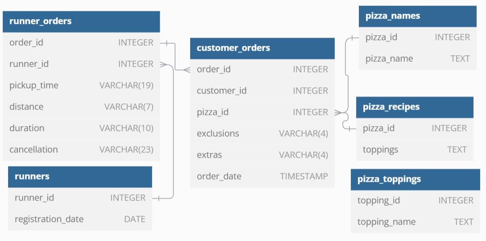

# Pizza runner Case


## Quick links 
[Queries Script](pizza_runner.sql)

[A. Pizza Metrics Solutions](#a-pizza-metrics) 

[B. Runner and Customer Experience Sol.](#b-runner-and-customer-experience)    

[C. Ingredient Optimisation Sol.](#c-ingredient-optimisation)   

[D. Pricing and Ratings Sol.](#d-pricing-and-ratings)

## ER-Diagram


## Case Study Questions
Each of the following case study questions can be answered using a single SQL statement:

### A. Pizza Metrics
1. How many pizzas were ordered?

```sql
SELECT 
    COUNT(order_id)
FROM
    customer_orders

+ -------------------- +
| COUNT(order_id)      |
+ -------------------- +
| 14                   |
+ -------------------- +
```
2. How many unique customer orders were made?

```sql
SELECT
	COUNT(DISTINCT order_id)
FROM 
    customer_orders

+ ----------------------------- +
| COUNT(DISTINCT order_id)      |
+ ----------------------------- +
| 10                            |
+ ----------------------------- +
```
3. How many successful orders were delivered by each runner?

```sql
SELECT
   runner_id
   , SUM(
   CASE 
      WHEN cancellation IS NULL THEN 1
      END
   ) AS successful_orders
FROM 
   runner_orders
GROUP BY
   runner_id

+ -------------- + ---------------------- +
| runner_id      | successful_orders      |
+ -------------- + ---------------------- +
| 1              | 4                      |
| 2              | 3                      |
| 3              | 1                      |
+ -------------- + ---------------------- +
```

4. How many of each type of pizza was delivered?

```sql
SELECT
   pn.pizza_name AS type_of_pizza
   , COUNT(co.pizza_id) AS pizzas_delivered
FROM
   customer_orders AS co
   JOIN pizza_names AS pn ON co.pizza_id = pn.pizza_id
   JOIN runner_orders AS ro ON co.order_id = ro.order_id
WHERE 
   cancellation IS NULL
GROUP BY 
   pn.pizza_name
ORDER BY 
   pizzas_delivered DESC

+ ------------------ + --------------------- +
| type_of_pizza      | pizzas_delivered      |
+ ------------------ + --------------------- +
| Meatlovers         | 9                     |
| Vegetarian         | 3                     |
+ ------------------ + --------------------- +
```
5. How many Vegetarian and Meatlovers were ordered by each customer?

```sql
SELECT
   co.customer_id AS customer
   , pn.pizza_name AS pizza
   , COUNT(co.pizza_id) AS pizzas_ordered
FROM 
   customer_orders AS co 
   JOIN pizza_names AS pn ON co.pizza_id = pn.pizza_id
GROUP BY 
   customer
   , pizza
ORDER BY 
   customer

+ ------------- + ---------- + ------------------- +
| customer      | pizza      | pizzas_ordered      |
+ ------------- + ---------- + ------------------- +
| 101           | Meatlovers | 2                   |
| 101           | Vegetarian | 1                   |
| 102           | Meatlovers | 2                   |
| 102           | Vegetarian | 1                   |
| 103           | Meatlovers | 3                   |
| 103           | Vegetarian | 1                   |
| 104           | Meatlovers | 3                   |
| 105           | Vegetarian | 1                   |
+ ------------- + ---------- + ------------------- +
```
6. What was the maximum number of pizzas delivered in a single order?

```sql
SELECT 
  MAX(pizza_count) AS max_pizzas_per_order
FROM
   (
   SELECT
   co.order_id AS order_id
   , COUNT(co.pizza_id) AS pizza_count
   FROM
   customer_orders AS co
    JOIN runner_orders AS ro ON co.order_id = ro.order_id
   WHERE ro.cancellation IS NULL
   GROUP BY
    order_id
   ) AS pizzas_per_order

+ ------------------------- +
| max_pizzas_per_order      |
+ ------------------------- +
| 3                         |
+ ------------------------- +
```

7. For each customer, how many delivered pizzas had at least 1 change and how many had no changes?  (change here implies exlusion o extras)

```sql
SELECT
   co.customer_id AS customer
   , COUNT(co.pizza_id)
   , SUM(CASE
      WHEN co.exclusions IS NOT NULL OR co.extras IS NOT NULL 
        THEN 1 ELSE 0
        END) AS at_least_1_change
   , SUM(CASE
      WHEN co.exclusions IS NULL AND co.extras IS NULL
		THEN 1 ELSE 0
        END) AS no_change
FROM
   customer_orders AS co
   JOIN runner_orders AS ro ON co.order_id = ro.order_id
WHERE 
   ro.cancellation IS NULL
GROUP BY
	customer

+ ------------- + ----------------------- + ---------------------- + -------------- +
| customer      | COUNT(co.pizza_id)      | at_least_1_change      | no_change      |
+ ------------- + ----------------------- + ---------------------- + -------------- +
| 101           | 2                       | 0                      | 2              |
| 102           | 3                       | 0                      | 3              |
| 103           | 3                       | 3                      | 0              |
| 104           | 3                       | 2                      | 1              |
| 105           | 1                       | 1                      | 0              |
+ ------------- + ----------------------- + ---------------------- + -------------- +
```

8. How many pizzas were delivered that had both exclusions and extras?

```sql
SELECT
  COUNT(co.pizza_id) AS pizzas_delivered_with_exlusions_and_extras
FROM
   customer_orders AS co
   JOIN runner_orders AS ro ON co.order_id = ro.order_id
WHERE 
   co.exclusions IS NOT NULL AND co.extras IS NOT NULL AND  ro.cancellation IS NULL

+ ----------------------------------------------- +
| pizzas_delivered_with_exlusions_and_extras      |
+ ----------------------------------------------- +
| 1                                               |
+ ----------------------------------------------- +
```
9. What was the total volume of pizzas ordered for each hour of the day?

```sql
SELECT 
   HOUR(order_time) AS hours
   , COUNT(order_id) AS volume_of_pizzas
FROM
   customer_orders
GROUP BY
   hours
ORDER BY
   hours

+ ---------- + --------------------- +
| hours      | volume_of_pizzas      |
+ ---------- + --------------------- +
| 11         | 1                     |
| 13         | 3                     |
| 18         | 3                     |
| 19         | 1                     |
| 21         | 3                     |
| 23         | 3                     |
+ ---------- + --------------------- +
```
10. What was the volume of orders for each day of the week?

```sql
SELECT 
   weekdays
   , pizza_volume
FROM
   (
   SELECT 
      DAYNAME(order_time) AS weekdays
      , COUNT(order_id) AS pizza_volume
   FROM
      customer_orders
   GROUP BY
      weekdays
   ) AS pizza_volume_by_weekday
ORDER BY
   FIELD(weekdays, 'Monday', 'Tuesday', 'Wednesday', 'Thursday', 'Friday', 'Saturday', 'Sunday')

+ ------------- + ----------------- +
| weekdays      | pizza_volume      |
+ ------------- + ----------------- +
| Wednesday     | 5                 |
| Thursday      | 3                 |
| Friday        | 1                 |
| Saturday      | 5                 |
+ ------------- + ----------------- +
```
### B. Runner and Customer Experience
1. How many runners signed up for each 1 week period? (i.e. week starts 2021-01-01)

```sql
SELECT
    WEEK(registration_date, 1) AS week,
    COUNT(runner_id) AS runners
FROM 
    runners
GROUP BY
    week

+ --------- + ------------ +
| week      | runners      |
+ --------- + ------------ +
| 0         | 2            |
| 1         | 1            |
| 2         | 1            |
+ --------- + ------------ +
```

2. What was the average time in minutes it took for each runner to arrive at the Pizza Runner HQ to pickup the order?

```sql
SELECT 
	ro.runner_id,
    ROUND(AVG(TIMESTAMPDIFF(MINUTE, co.order_time, ro.pickup_time)), 2) AS average_duration_in_minutes
FROM 
    runner_orders AS ro
    INNER JOIN customer_orders AS co
    ON ro.order_id = co.order_id
WHERE 
    ro.pickup_time IS NOT NULL
GROUP BY
   ro.runner_id

+ -------------- + -------------------------------- +
| runner_id      | average_duration_in_minutes      |
+ -------------- + -------------------------------- +
| 1              | 15.33                            |
| 2              | 23.40                            |
| 3              | 10.00                            |
+ -------------- + -------------------------------- +
```

3. Is there any relationship between the number of pizzas and how long the order takes to prepare?

```sql
WITH CTE AS (
    SELECT
        co.order_id,
        COUNT(co.pizza_id) AS number_of_pizzas,
        MAX(TIMESTAMPDIFF(MINUTE, co.order_time, ro.pickup_time)) AS prep_time
    FROM 
        customer_orders AS co
    JOIN 
        runner_orders AS ro 
        ON co.order_id = ro.order_id
    WHERE 
        ro.cancellation IS NULL
    GROUP BY
        co.order_id
)
SELECT 
    number_of_pizzas,
    AVG(prep_time) AS avg_time_prep,
    AVG(prep_time) / number_of_pizzas AS avg_time_prep_per_pizza
FROM 
    CTE
GROUP BY
    number_of_pizzas

+ --------------------- + ------------------ + ---------------------------- +
| number_of_pizzas      | avg_time_prep      | avg_time_prep_per_pizza      |
+ --------------------- + ------------------ + ---------------------------- +
| 1                     | 12.0000            | 12.00000000                  |
| 2                     | 18.0000            | 9.00000000                   |
| 3                     | 29.0000            | 9.66666667                   |
+ --------------------- + ------------------ + ---------------------------- +
```
It takes an average of 10 minutes to prepare one pizza (based on the average of the avg_time_prep_per_pizza values). 

4. What was the average distance travelled for each customer?

```sql
SELECT
   co.customer_id As customer
   , AVG(ro.distance) AS avg_distance
FROM 
   customer_orders AS co
   JOIN runner_orders AS ro
   ON ro.order_id = co.order_id
WHERE 
   cancellation IS NULL
GROUP BY
   customer

+ ------------- + ----------------- +
| customer      | avg_distance      |
+ ------------- + ----------------- +
| 101           | 20                |
| 102           | 16.333333333333332 |
| 103           | 23                |
| 104           | 10                |
| 105           | 25                |
+ ------------- + ----------------- +
```
5. What was the difference between the longest and shortest delivery times for all orders?

```sql
SELECT 
   MAX(duration) - MIN(duration) as time_diff
FROM 
   runner_orders

+ -------------- +
| time_diff      |
+ -------------- +
| 30             |
+ -------------- +
```
6. What was the average speed for each runner for each delivery and do you notice any trend for these values?

```sql
SELECT
   runner_id,
   order_id,
   ROUND(AVG(60 * distance / duration), 0) AS avg_speed
FROM 
   runner_orders
WHERE 
   cancellation IS NULL
GROUP BY
   runner_id,
   order_id
ORDER BY
   runner_id,
   order_id

+ -------------- + ------------- + -------------- +
| runner_id      | order_id      | avg_speed      |
+ -------------- + ------------- + -------------- +
| 1              | 1             | 38             |
| 1              | 2             | 44             |
| 1              | 3             | 39             |
| 1              | 10            | 60             |
| 2              | 4             | 34             |
| 2              | 7             | 60             |
| 2              | 8             | 92             |
| 3              | 5             | 40             |
+ -------------- + ------------- + -------------- +
```
It is observed that each runner improves their speed with each order.

7. What is the successful delivery percentage for each runner

```sql
SELECT 
   runner_id
   , SUM(CASE
       WHEN pickup_time IS NULL THEN 0
       ELSE 1
	   END) / COUNT(order_id) * 100 AS successful_delivery_percentage
FROM 
   runner_orders
GROUP BY
   runner_id

+ -------------- + ----------------------------------- +
| runner_id      | successful_delivery_percentage      |
+ -------------- + ----------------------------------- +
| 1              | 100.0000                            |
| 2              | 75.0000                             |
| 3              | 50.0000                             |
+ -------------- + ----------------------------------- +
```
### C. Ingredient Optimisation
1. What are the standard ingredients for each pizza?

```sql
SELECT 
    pt.topping_name
	, COUNT(DISTINCT pizza_id) AS pizzas
FROM pizza_recipes,
JSON_TABLE(
    CONCAT('[', toppings, ']'), 
    "$[*]" COLUMNS(topping INT PATH "$")
) AS jt -- transform topping_id values into rows values
  INNER JOIN pizza_toppings AS pt 
  ON jt.topping = pt.topping_id
GROUP BY 
   pt.topping_name
HAVING 
   pizzas = 2

+ ----------------- + ----------- +
| topping_name      | pizzas      |
+ ----------------- + ----------- +
| Cheese            | 2           |
| Mushrooms         | 2           |
+ ----------------- + ----------- +
```
Cheese and mushrooms would be the standards for all the pizzas.

2. What was the most commonly added extra?
One simple way to answer this question is by showing the top 1 extra (as above) or by showing the extra with the highest proportion.

```sql
SELECT 
    pt.topping_name AS extra,
    COUNT(pizza_id) AS pizzas
FROM 
    customer_orders,
    JSON_TABLE(
        CONCAT('[', extras, ']'), 
        "$[*]" COLUMNS(extras INT PATH "$")
    ) AS jt
JOIN 
    pizza_toppings AS pt 
    ON jt.extras = pt.topping_id
GROUP BY 
    pt.topping_name
ORDER BY 
    pizzas DESC
LIMIT 1

+ ---------- + ----------- +
| extra      | pizzas      |
+ ---------- + ----------- +
| Bacon      | 4           |
+ ---------- + ----------- +
1 rows
```

```sql
WITH CTE AS (
          SELECT 
              pt.topping_name AS extra
			, COUNT(pizza_id) AS pizzas
          FROM  
              customer_orders,
             JSON_TABLE(
				CONCAT('[', extras, ']'), 
				"$[*]" COLUMNS(extras INT PATH "$")
				) AS jt -- transform topping_id values into rows values
			 JOIN pizza_toppings AS pt
                 ON jt.extras = pt.topping_id
		  GROUP BY
				pt.topping_name
) 
SELECT 
   extra
   , pizzas / SUM(pizzas) OVER() AS porportion -- SUM(pizzas) OVER () calculates the total sum of pizzas across all rows
FROM 
   CTE

+ ---------- + --------------- +
| extra      | porportion      |
+ ---------- + --------------- +
| Bacon      | 0.6667          |
| Chicken    | 0.1667          |
| Cheese     | 0.1667          |
+ ---------- + --------------- +
```
3. What was the most common exclusion?

```sql
SELECT 
    pt.topping_name AS exclusion,
    COUNT(pizza_id) AS pizzas
FROM 
    customer_orders,
    JSON_TABLE(
        CONCAT('[', exclusions, ']'), 
        "$[*]" COLUMNS(exclusions INT PATH "$")
    ) AS jt
JOIN 
    pizza_toppings AS pt 
    ON jt.exclusions = pt.topping_id
GROUP BY 
    pt.topping_name
ORDER BY 
    pizzas DESC
LIMIT 1

+ -------------- + ----------- +
| exclusion      | pizzas      |
+ -------------- + ----------- +
| Cheese         | 4           |
+ -------------- + ----------- +
```
4. Generate an order item for each record in the customers_orders table in the format of one of the following:
-- Meat Lovers
-- Meat Lovers - Exclude Beef
-- Meat Lovers - Extra Bacon
-- Meat Lovers - Exclude Cheese, Bacon - Extra Mushroom, Peppers

```sql
WITH EXTRAS AS (
		SELECT 
			co.order_id,
			co.pizza_id,
            co.extras,
			GROUP_CONCAT(DISTINCT pt.topping_name ORDER BY pt.topping_name SEPARATOR ', ') AS added_extra 
		FROM 
			customer_orders AS co,
			JSON_TABLE(
			CONCAT('[', extras, ']'), 
			"$[*]" COLUMNS(extras INT PATH "$")
			) AS jt
			JOIN 
				pizza_toppings AS pt 
				ON jt.extras = pt.topping_id
		GROUP BY
			co.order_id,
			co.pizza_id,
            co.extras
)
, EXCLUDED AS (
		SELECT 
			co.order_id,
			co.pizza_id,
            co.exclusions,
			GROUP_CONCAT(DISTINCT pt.topping_name ORDER BY pt.topping_name SEPARATOR ', ') AS excluded
		FROM 
			customer_orders AS co,
			JSON_TABLE(
			CONCAT('[', exclusions, ']'), 
			"$[*]" COLUMNS(exclusions INT PATH "$")
			) AS jt
		JOIN 
			pizza_toppings AS pt 
			ON jt.exclusions = pt.topping_id
		GROUP BY
			co.order_id,
			co.pizza_id,
            co.exclusions
)
SELECT 
   co.order_id,
   pn.pizza_name,
   COALESCE(co.extras, '') AS added_extra,
   COALESCE(co.exclusions, '') AS exluded,
   CONCAT(CASE WHEN
        pn.pizza_name = 'Meatlovers' THEN 'Meat Lovers' ELSE pn.pizza_name END, 
        COALESCE(CONCAT(' - Extra ', added_extra), ''), 
        COALESCE(CONCAT(' - Exclude ', excluded), '')
    ) AS order_details
FROM 
   customer_orders AS co
LEFT JOIN EXTRAS AS ext ON co.order_id = ext.order_id AND co.pizza_id = ext.pizza_id AND ext.extras = co.extras
LEFT JOIN EXCLUDED AS exc ON co.order_id = exc.order_id AND co.pizza_id = exc.pizza_id AND exc.exclusions = co.exclusions
INNER JOIN pizza_names AS pn ON pn.pizza_id = co.pizza_id

+ ------------- + --------------- + ---------------- + ------------ + ------------------ +
| order_id      | pizza_name      | added_extra      | exluded      | order_details      |
+ ------------- + --------------- + ---------------- + ------------ + ------------------ +
| 1             | Meatlovers      |                  |              | Meat Lovers        |
| 2             | Meatlovers      |                  |              | Meat Lovers        |
| 3             | Meatlovers      |                  |              | Meat Lovers        |
| 3             | Vegetarian      |                  |              | Vegetarian         |
| 4             | Meatlovers      |                  | 4            | Meat Lovers - Exclude Cheese |
| 4             | Meatlovers      |                  | 4            | Meat Lovers - Exclude Cheese |
| 4             | Vegetarian      |                  | 4            | Vegetarian - Exclude Cheese |
| 5             | Meatlovers      | 1                |              | Meat Lovers - Extra Bacon |
| 6             | Vegetarian      |                  |              | Vegetarian         |
| 7             | Vegetarian      | 1                |              | Vegetarian - Extra Bacon |
| 8             | Meatlovers      |                  |              | Meat Lovers        |
| 9             | Meatlovers      | 1, 5             | 4            | Meat Lovers - Extra Bacon, Chicken - Exclude Cheese |
| 10            | Meatlovers      |                  |              | Meat Lovers        |
| 10            | Meatlovers      | 1, 4             | 2, 6         | Meat Lovers - Extra Bacon, Cheese - Exclude BBQ Sauce, Mushrooms |
+ ------------- + --------------- + ---------------- + ------------ + ------------------ +
```
5. Generate an alphabetically ordered comma separated ingredient list for each pizza order from the customer_orders table and add a 2x in front of any relevant ingredients
- For example: "Meat Lovers: 2xBacon, Beef, ... , Salami"

```sql
WITH EXTRAS AS (
    SELECT 
        co.order_id,
        co.pizza_id,
        co.extras,
        pt.topping_id,
        pt.topping_name AS added_extras
    FROM 
        customer_orders AS co,
        JSON_TABLE(
            CONCAT('[', extras, ']'), 
            "$[*]" COLUMNS(extras INT PATH "$")
        ) AS jt
    JOIN 
        pizza_toppings AS pt 
        ON jt.extras = pt.topping_id
),
EXCLUDED AS (
    SELECT 
        co.order_id,
        co.pizza_id,
        co.exclusions,
        pt.topping_id,
        pt.topping_name AS excluded
    FROM 
        customer_orders AS co,
        JSON_TABLE(
            CONCAT('[', exclusions, ']'), 
            "$[*]" COLUMNS(exclusions INT PATH "$")
        ) AS jt
    JOIN 
        pizza_toppings AS pt 
        ON jt.exclusions = pt.topping_id
),
ORDERS AS (
    SELECT 
        co.order_id,
        co.pizza_id,
        jt.toppings AS topping_id,
        pt.topping_name
    FROM 
        customer_orders AS co
    INNER JOIN pizza_recipes AS pr 
        ON pr.pizza_id = co.pizza_id,
        JSON_TABLE(
            CONCAT('[', pr.toppings, ']'), 
            "$[*]" COLUMNS(toppings INT PATH "$")
        ) AS jt
    INNER JOIN pizza_toppings AS pt 
        ON pt.topping_id = jt.toppings
),
ORDERS_WITH_EXTRAS_AND_EXCLUSIONS AS (
    SELECT 
        O.order_id,
        O.pizza_id,
        O.topping_id,
        O.topping_name
    FROM 
        ORDERS AS O
    LEFT JOIN EXCLUDED AS EXC 
        ON EXC.order_id = O.order_id AND EXC.topping_id = O.topping_id
    WHERE 
        EXC.topping_id IS NULL

    UNION ALL

    SELECT 
        order_id,
        pizza_id,
        topping_id,
        added_extras AS topping_name
    FROM 
        EXTRAS
),
INGREDIENT_TOTAL AS (
    SELECT 
        order_id,
        pn.pizza_name,
        topping_name,
        COUNT(topping_id) AS n
    FROM 
        ORDERS_WITH_EXTRAS_AND_EXCLUSIONS AS O
    INNER JOIN pizza_names AS pn 
        ON pn.pizza_id = O.pizza_id
    GROUP BY
        order_id,
        pn.pizza_name,
        topping_name
)
, SUMMARY AS (
SELECT 
    order_id,
    pizza_name,
    GROUP_CONCAT(
        DISTINCT CASE 
            WHEN n > 1 THEN CONCAT(n, 'x', topping_name)
            ELSE topping_name
        END SEPARATOR ', '
    ) AS ingred
FROM 
    INGREDIENT_TOTAL
GROUP BY
    order_id,
    pizza_name
)
SELECT 
    order_id,
    CONCAT(CASE WHEN
        pizza_name = 'Meatlovers' THEN 'Meat Lovers' ELSE pizza_name END, ': ', ingred) AS ingredient_list
FROM 
    SUMMARY
------ + -------------------- +
| order_id      | ingredient_list      |
+ ------------- + -------------------- +
| 1             | Meat Lovers: Bacon, BBQ Sauce, Beef, Cheese, Chicken, Mushrooms, Pepperoni, Salami |
| 2             | Meat Lovers: Bacon, BBQ Sauce, Beef, Cheese, Chicken, Mushrooms, Pepperoni, Salami |
| 3             | Meat Lovers: Bacon, BBQ Sauce, Beef, Cheese, Chicken, Mushrooms, Pepperoni, Salami |
| 3             | Vegetarian: Cheese, Mushrooms, Onions, Peppers, Tomato Sauce, Tomatoes |
| 4             | Meat Lovers: 2xBacon, 2xBBQ Sauce, 2xBeef, 2xChicken, 2xMushrooms, 2xPepperoni, 2xSalami |
| 4             | Vegetarian: Mushrooms, Onions, Peppers, Tomato Sauce, Tomatoes |
| 5             | Meat Lovers: 2xBacon, BBQ Sauce, Beef, Cheese, Chicken, Mushrooms, Pepperoni, Salami |
| 6             | Vegetarian: Cheese, Mushrooms, Onions, Peppers, Tomato Sauce, Tomatoes |
| 7             | Vegetarian: Bacon, Cheese, Mushrooms, Onions, Peppers, Tomato Sauce, Tomatoes |
| 8             | Meat Lovers: Bacon, BBQ Sauce, Beef, Cheese, Chicken, Mushrooms, Pepperoni, Salami |
| 9             | Meat Lovers: 2xBacon, 2xChicken, BBQ Sauce, Beef, Mushrooms, Pepperoni, Salami |
| 10            | Meat Lovers: 2xBeef, 2xChicken, 2xPepperoni, 2xSalami, 3xBacon, 3xCheese |
+ ------------- + -------------------- +
```

6. What is the total quantity of each ingredient used in all delivered pizzas sorted by most frequent first?     

```sql
WITH EXTRAS AS (
    SELECT 
        co.order_id,
        co.pizza_id,
        co.extras,
        pt.topping_id,
        pt.topping_name AS added_extras
    FROM 
        customer_orders AS co,
        JSON_TABLE(
            CONCAT('[', extras, ']'), 
            "$[*]" COLUMNS(extras INT PATH "$")
        ) AS jt
    JOIN 
        pizza_toppings AS pt 
        ON jt.extras = pt.topping_id
),
EXCLUDED AS (
    SELECT 
        co.order_id,
        co.pizza_id,
        co.exclusions,
        pt.topping_id,
        pt.topping_name AS excluded
    FROM 
        customer_orders AS co,
        JSON_TABLE(
            CONCAT('[', exclusions, ']'), 
            "$[*]" COLUMNS(exclusions INT PATH "$")
        ) AS jt
    JOIN 
        pizza_toppings AS pt 
        ON jt.exclusions = pt.topping_id
),
ORDERS AS (
    SELECT 
        co.order_id,
        co.pizza_id,
        jt.toppings AS topping_id,
        pt.topping_name
    FROM 
        customer_orders AS co
    INNER JOIN pizza_recipes AS pr 
        ON pr.pizza_id = co.pizza_id,
        JSON_TABLE(
            CONCAT('[', pr.toppings, ']'), 
            "$[*]" COLUMNS(toppings INT PATH "$")
        ) AS jt
    INNER JOIN pizza_toppings AS pt 
        ON pt.topping_id = jt.toppings
),
ORDERS_WITH_EXTRAS_AND_EXCLUSIONS AS (
    SELECT 
        O.order_id,
        O.pizza_id,
        O.topping_id,
        O.topping_name
    FROM 
        ORDERS AS O
    LEFT JOIN EXCLUDED AS EXC 
        ON EXC.order_id = O.order_id AND EXC.topping_id = O.topping_id
    WHERE 
        EXC.topping_id IS NULL

    UNION ALL

    SELECT 
        order_id,
        pizza_id,
        topping_id,
        added_extras AS topping_name
    FROM 
        EXTRAS
)
SELECT 
       topping_name,
       COUNT(topping_id) AS n
FROM 
        ORDERS_WITH_EXTRAS_AND_EXCLUSIONS AS O
        INNER JOIN runner_orders AS ro ON O.order_id = ro.order_id
 WHERE cancellation IS NULL  
 GROUP BY
        topping_name
ORDER BY 
		COUNT(topping_id) DESC

+ ----------------- + ------ +
| topping_name      | n      |
+ ----------------- + ------ +
| Bacon             | 12     |
| Cheese            | 10     |
| Mushrooms         | 10     |
| Beef              | 9      |
| Chicken           | 9      |
| Pepperoni         | 9      |
| Salami            | 9      |
| BBQ Sauce         | 7      |
| Onions            | 3      |
| Peppers           | 3      |
| Tomatoes          | 3      |
| Tomato Sauce      | 3      |
+ ----------------- + ------ +
```

### D. Pricing and Ratings
1. If a Meat Lovers pizza costs $12 and Vegetarian costs $10 and there were no charges for changes - how much money has Pizza Runner made so far if there are no delivery fees?

```sql
SELECT 
    SUM(CASE WHEN co.pizza_id = 1 THEN 12 ELSE 10 END) AS total_price
FROM 
   customer_orders AS co
   JOIN runner_orders AS ro
       ON ro.order_id = co.order_id
WHERE 
    ro.cancellation IS NULL

+ ---------------- +
| total_price      |
+ ---------------- +
| 138              |
+ ---------------- +
```
2. What if there was an additional $1 charge for any pizza extras?

- Add cheese is $1 extra

```sql
WITH CTE AS (
    SELECT 
        co.order_id,
        co.pizza_id,
        co.extras,
        LENGTH(extras) - LENGTH(REPLACE(extras, ',', '')) + 1 AS number_of_extras
    FROM 
        customer_orders AS co
    JOIN 
        runner_orders AS ro
        ON ro.order_id = co.order_id
    WHERE 
        ro.cancellation IS NULL
)
SELECT
    SUM(
        CASE 
            WHEN pizza_id = 1 AND number_of_extras IS NULL THEN 12
            WHEN pizza_id = 2 AND number_of_extras IS NULL THEN 10
            WHEN pizza_id = 1 AND number_of_extras >= 1 THEN 12 + number_of_extras * 1
            WHEN pizza_id = 2 AND number_of_extras >= 1 THEN 10 + number_of_extras * 1
            ELSE 0
        END
    ) AS total_revenue
FROM 
    CTE;
```

 3. The Pizza Runner team now wants to add an additional ratings system that allows customers to rate their runner, how would you design an additional table for this new dataset - generate a schema for this new table and insert your own data for ratings for each successful customer order between 1 to 5.

```sql
DROP TABLE IF EXISTS ratings;
CREATE TABLE ratings (
order_id int,
rating TINYINT NOT NULL CHECK (rating BETWEEN 1 AND 5));

INSERT INTO ratings VALUES 
(1, 5), (2, 5), (3, 3), (4, 4), (5, 2), (7, 1), (8, 3), (10, 4);

SELECT * FROM ratings;

 SELECT * FROM ratings

+ ------------- + ----------- +
| order_id      | rating      |
+ ------------- + ----------- +
| 1             | 5           |
| 2             | 5           |
| 3             | 3           |
| 4             | 4           |
| 5             | 2           |
| 7             | 1           |
| 8             | 3           |
| 10            | 4           |
+ ------------- + ----------- +
```
4. Using your newly generated table - can you join all of the information together to form a table which has the following information for successful deliveries?
- customer_id
- order_id
- runner_id
- rating
- order_time
- pickup_time
- Time between order and pickup
- Delivery duration
- Average speed
- Total number of pizzas

```sql
SELECT
	co.customer_id,
	co.order_id,
	ro.runner_id,
	r.rating,
	co.order_time,
	ro.pickup_time,
	ROUND(TIMESTAMPDIFF(MINUTE, co.order_time, ro.pickup_time), 0) AS time_between_order_and_pickup,
	ro.duration AS delivery_duration,
	ROUND(AVG((ro.distance / ro.duration) * 60), 0) AS average_speed,
	COUNT(co.pizza_id) AS Total_number_of_pizzas
FROM 
	customer_orders AS co
    INNER JOIN runner_orders AS  ro
		ON co.order_id = ro.order_id
    INNER JOIN ratings AS r
		ON ro.order_id = r.order_id
WHERE
	ro.cancellation IS NULL
GROUP BY
	co.customer_id,
	co.order_id,
	ro.runner_id,
	r.rating,
	co.order_time,
	ro.pickup_time,
    ro.duration
ORDER BY
    customer_id

+ ---------------- + ------------- + -------------- + ----------- + --------------- + ---------------- + ---------------------------------- + ---------------------- + ------------------ + --------------------------- +
| customer_id      | order_id      | runner_id      | rating      | order_time      | pickup_time      | time_between_order_and_pickup      | delivery_duration      | average_speed      | Total_number_of_pizzas      |
+ ---------------- + ------------- + -------------- + ----------- + --------------- + ---------------- + ---------------------------------- + ---------------------- + ------------------ + --------------------------- +
| 101              | 1             | 1              | 5           | 2020-01-01 18:05:02 | 2020-01-01 18:15:34 | 10                                 | 32                     | 38                 | 1                           |
| 101              | 2             | 1              | 5           | 2020-01-01 19:00:52 | 2020-01-01 19:10:54 | 10                                 | 27                     | 44                 | 1                           |
| 102              | 3             | 1              | 3           | 2020-01-02 23:51:23 | 2020-01-03 00:12:37 | 21                                 | 20                     | 39                 | 2                           |
| 102              | 8             | 2              | 3           | 2020-01-09 23:54:33 | 2020-01-10 00:15:02 | 20                                 | 15                     | 92                 | 1                           |
| 103              | 4             | 2              | 4           | 2020-01-04 13:23:46 | 2020-01-04 13:53:03 | 29                                 | 40                     | 34                 | 3                           |
| 104              | 5             | 3              | 2           | 2020-01-08 21:00:29 | 2020-01-08 21:10:57 | 10                                 | 15                     | 40                 | 1                           |
| 104              | 10            | 1              | 4           | 2020-01-11 18:34:49 | 2020-01-11 18:50:20 | 15                                 | 10                     | 60                 | 2                           |
| 105              | 7             | 2              | 1           | 2020-01-08 21:20:29 | 2020-01-08 21:30:45 | 10                                 | 25                     | 60                 | 1                           |
+ ---------------- + ------------- + -------------- + ----------- + --------------- + ---------------- + ---------------------------------- + ---------------------- + ------------------ + --------------------------- +
```
5. If a Meat Lovers pizza was $12 and Vegetarian $10 fixed prices with no cost for extras and each runner is paid $0.30 per kilometre traveled - how much money does Pizza Runner have left over after these deliveries?

```sql
WITH CTE AS (
	SELECT 
		co.customer_id,
		co.order_id,
		pizza_id,
		COUNT(pizza_id),
		CASE
			WHEN co.pizza_id = 1 THEN COUNT(co.pizza_id) * 12
			WHEN co.pizza_id = 2 THEN COUNT(co.pizza_id) * 10
			ELSE 0
			END AS price,
		ro.distance * 0.30 AS cost_due_to_distance
	FROM
		customer_orders AS co
		JOIN runner_orders AS ro
			ON co.order_id = ro.order_id
	WHERE 
		ro.cancellation IS NULL
GROUP BY
		co.customer_id,
		co.order_id,
		co.pizza_id,
		ro.distance
)
SELECT
   SUM(price) - SUM(cost_due_to_distance) AS total_profit
FROM 
   CTE

+ ----------------- +
| total_profit      |
+ ----------------- +
| 84                |
+ ----------------- +
```
Pizza Runner has $84 left.