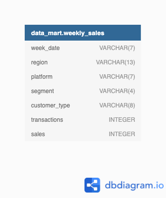

# Data Mart Case


## Quick links 
[Queries Script](data_mart.sql)

[A. Data Cleansing Steps](#a-data-cleansing-steps) 

[B. Data Exploration](#b-data-exploration)  

[C. Before & after analysis](#c-before--after-analysis)

## ER-Diagram



### A. Data Cleansing Steps
- In a single query, perform the following operations and generate a new table in the data_mart schema named clean_weekly_sales:
- Convert the week_date to a DATE format
- Add a week_number as the second column for each week_date value, for example any value from the 1st of January to 7th of January will be 1, 8th to 14th will be 2 etc
- Add a month_number with the calendar month for each week_date value as the 3rd column
- Add a calendar_year column as the 4th column containing either 2018, 2019 or 2020 values
- Add a new column called age_band after the original segment column using the following mapping on the number inside the segment value


| segment    | age_band       |
| ---------- | -------------- |
| 1          | Young Adults   |
| 2          | Middle Aged    |
| 3 or 4     | Retirees       |
| ---------- | -------------- |

- Add a new demographic column using the following mapping for the first letter in the segment values:


| segment   | demographic   |
| --------- | ------------- |
| C         | Couples       |
| F         | Families      |
| --------- | ------------- |

- Ensure all null string values with an "unknown" string value in the original segment column as well as the new age_band and demographic columns
- Generate a new avg_transaction column as the sales value divided by transactions rounded to 2 decimal places for each record

```sql
CREATE TABLE clean_weekly_sales AS 
SELECT
   STR_TO_DATE(week_date, '%d/%m/%y') AS week_date,
   WEEK(STR_TO_DATE(week_date, '%d/%m/%y')) AS week_number,
   MONTH(STR_TO_DATE(week_date, '%d/%m/%y')) AS month_number,
   YEAR(STR_TO_DATE(week_date, '%d/%m/%y')) AS calendar_year,
   region,
   platform,
   segment,
   customer_type,
   CASE
   WHEN RIGHT(segment, 1) = '1' THEN 'Young Adults'
   WHEN RIGHT(segment, 1) = '2' THEN 'Middle Aged'
   WHEN RIGHT(segment, 1) IN ('3', '4') THEN 'Retirees'
    ELSE 'unknown' END AS age_band,
   CASE
   WHEN LEFT(segment, 1) = 'C' THEN 'Couples'
   WHEN LEFT(segment, 1) = 'F' THEN 'Families'
    ELSE 'unknown' END AS demographic,
   transactions,
   CAST(sales AS SIGNED) AS sales,  -- This converts the sales column into a SIGNED INTEGER (which can be positive or negative)
   ROUND(CAST(sales AS DECIMAL(10, 2)) / transactions, 2) AS avg_transaction
FROM 
   weekly_sales;
```
```sql  
SELECT *
FROM clean_weekly_sales;

DESCRIBE clean_weekly_sales;

+----------------+---------------+------+-----+---------+-------+
| Field          | Type          | Null | Key | Default | Extra |
+----------------+---------------+------+-----+---------+-------+
| week_date      | date          | YES  |     | NULL    |       |
| week_number    | int           | YES  |     | NULL    |       |
| month_number   | int           | YES  |     | NULL    |       |
| calendar_year  | int           | YES  |     | NULL    |       |
| region         | varchar(13)   | YES  |     | NULL    |       |
| platform       | varchar(7)    | YES  |     | NULL    |       |
| segment        | varchar(4)    | YES  |     | NULL    |       |
| customer_type  | varchar(8)    | YES  |     | NULL    |       |
| age_band       | varchar(12)   | NO   |     | NULL    |       |
| demographic    | varchar(8)    | NO   |     | NULL    |       |
| transactions   | int           | YES  |     | NULL    |       |
| sales          | bigint        | YES  |     | NULL    |       |
| avg_transaction| decimal(11,2) | YES  |     | NULL    |       |
+----------------+---------------+------+-----+---------+-------+
13 rows
```
### B. Data Exploration
1. What day of the week is used for each week_date value?

```sql
SELECT
   DISTINCT(DAYNAME(week_date)) AS day_of_the_week
FROM 
   clean_weekly_sales
LIMIT 15;

+ -------------------- +
| day_of_the_week      |
+ -------------------- +
| Monday               |
+ -------------------- +
1 rows
```  
2. What range of week numbers are missing from the dataset?

```sql   
WITH RECURSIVE WEEK_NUMBER AS (
    SELECT 1 AS w_number  -- Base case: start from number 1
    UNION ALL
    SELECT w_number + 1   -- Recursive case: add 1 to the previous number
    FROM WEEK_NUMBER
    WHERE w_number < 52    -- Stop when the number reaches 53
)
SELECT  
   wn.w_number AS week_number
FROM 
   WEEK_NUMBER wn
    LEFT JOIN clean_weekly_sales cws ON wn.w_number = cws.week_number
WHERE 
    week_number IS NULL
;

+ ---------------- +
| week_number      |
+ ---------------- +
| 1                |
| 2                |
| 3                |
| 4                |
| 5                |
| 6                |
| 7                |
| 8                |
| 9                |
| 10               |
| 11               |
| 36               |
| 37               |
| 38               |
| 39               |
| 40               |
| 41               |
| 42               |
| 43               |
| 44               |
| 45               |
| 46               |
| 47               |
| 48               |
| 49               |
| 50               |
| 51               |
| 52               |
+ ---------------- +
28 rows
```
- Answer: weeks 1 - 11 and 36 - 52

3. How many total transactions were there for each year in the dataset?

```sql
SELECT 
   calendar_year,
   SUM(transactions) AS total_transactions
FROM 
   clean_weekly_sales
GROUP BY
    calendar_year
ORDER BY
    calendar_year;

+ ------------------ + ----------------------- +
| calendar_year      | total_transactions      |
+ ------------------ + ----------------------- +
| 2018               | 346406460               |
| 2019               | 365639285               |
| 2020               | 375813651               |
+ ------------------ + ----------------------- +
3 rows
```
    
4. What is the total sales for each region for each month?

```sql
SELECT 
   month_number,
   region,
   SUM(sales) AS total_sales
FROM 
   clean_weekly_sales
GROUP BY
   2, 1
ORDER BY
   2, 1;

+ ----------------- + ----------- + ---------------- +
| month_number      | region      | total_sales      |
+ ----------------- + ----------- + ---------------- +
| 3                 | AFRICA      | 567767480        |
| 4                 | AFRICA      | 1911783504       |
| 5                 | AFRICA      | 1647244738       |
| 6                 | AFRICA      | 1767559760       |
| 7                 | AFRICA      | 1960219710       |
| 8                 | AFRICA      | 1809596890       |
| 9                 | AFRICA      | 276320987        |
| 3                 | ASIA        | 529770793        |
| 4                 | ASIA        | 1804628707       |
| 5                 | ASIA        | 1526285399       |
| 6                 | ASIA        | 1619482889       |
| 7                 | ASIA        | 1768844756       |
| 8                 | ASIA        | 1663320609       |
| 9                 | ASIA        | 252836807        |
| 3                 | CANADA      | 144634329        |
| 4                 | CANADA      | 484552594        |
| 5                 | CANADA      | 412378365        |
| 6                 | CANADA      | 443846698        |
| 7                 | CANADA      | 477134947        |
| 8                 | CANADA      | 447073019        |
| 9                 | CANADA      | 69067959         |
| 3                 | EUROPE      | 35337093         |
| 4                 | EUROPE      | 127334255        |
| 5                 | EUROPE      | 109338389        |
| 6                 | EUROPE      | 122813826        |
| 7                 | EUROPE      | 136757466        |
| 8                 | EUROPE      | 122102995        |
| 9                 | EUROPE      | 18877433         |
| 3                 | OCEANIA     | 783282888        |
| 4                 | OCEANIA     | 2599767620       |
| 5                 | OCEANIA     | 2215657304       |
| 6                 | OCEANIA     | 2371884744       |
| 7                 | OCEANIA     | 2563459400       |
| 8                 | OCEANIA     | 2432313652       |
| 9                 | OCEANIA     | 372465518        |
| 3                 | SOUTH AMERICA | 71023109       |
| 4                 | SOUTH AMERICA | 238451531      |
| 5                 | SOUTH AMERICA | 201391809      |
| 6                 | SOUTH AMERICA | 218247455      |
| 7                 | SOUTH AMERICA | 235582776      |
| 8                 | SOUTH AMERICA | 221166052      |
| 9                 | SOUTH AMERICA | 34175583       |
| 3                 | USA         | 225353043        |
| 4                 | USA         | 759786323        |
| 5                 | USA         | 655967121        |
| 6                 | USA         | 703878990        |
| 7                 | USA         | 760331754        |
| 8                 | USA         | 712002790        |
| 9                 | USA         | 110532368        |
+ ----------------- + ----------- + ---------------- +
49 rows
```
5. What is the total count of transactions for each platform

```sql
SELECT
   platform,
   SUM(transactions) AS total_transactions
FROM 
   clean_weekly_sales
GROUP BY
   platform;

+ ------------- + ----------------------- +
| platform      | total_transactions      |
+ ------------- + ----------------------- +
| Retail        | 1081934227              |
| Shopify       | 5925169                 |
+ ------------- + ----------------------- +
2 rows
 ```  
   
6. What is the percentage of sales for Retail vs Shopify for each month?

```sql
WITH MONTHLY_SALES AS (
SELECT
   calendar_year,
   month_number,
   platform,
   SUM(sales) AS total_sales
 FROM 
   clean_weekly_sales
GROUP BY
   platform,
   month_number,
   calendar_year
ORDER BY month_number
)
SELECT
  calendar_year,
  month_number,
  SUM(CASE WHEN platform IN ('Shopify', 'Retail') THEN total_sales END) AS total_monthly_sales,
  ROUND(100 * SUM(CASE WHEN platform = 'Retail' THEN total_sales END) / SUM(CASE WHEN platform IN ('Shopify', 'Retail') THEN total_sales END),1) AS retail_percentage,
  ROUND(100 * SUM(CASE WHEN platform = 'Shopify' THEN total_sales END) / SUM(CASE WHEN platform IN ('Shopify', 'Retail') THEN total_sales END),1) AS shopify_percentage
FROM
   MONTHLY_SALES    
GROUP BY
   month_number,
   calendar_year
ORDER BY
	calendar_year,
    month_number;

+ ------------------ + ----------------- + ------------------------ + ---------------------- + ----------------------- +
| calendar_year      | month_number      | total_monthly_sales      | retail_percentage      | shopify_percentage      |
+ ------------------ + ----------------- + ------------------------ + ---------------------- + ----------------------- +
| 2018               | 3                 | 536755452                | 97.9                   | 2.1                     |
| 2018               | 4                 | 2672804647               | 97.9                   | 2.1                     |
| 2018               | 5                 | 2128656424               | 97.7                   | 2.3                     |
| 2018               | 6                 | 2108452203               | 97.8                   | 2.2                     |
| 2018               | 7                 | 2707198472               | 97.8                   | 2.2                     |
| 2018               | 8                 | 2190542267               | 97.7                   | 2.3                     |
| 2018               | 9                 | 552971362                | 97.7                   | 2.3                     |
| 2019               | 3                 | 581317054                | 97.7                   | 2.3                     |
| 2019               | 4                 | 2900147321               | 97.8                   | 2.2                     |
| 2019               | 5                 | 2277531812               | 97.5                   | 2.5                     |
| 2019               | 6                 | 2238853921               | 97.4                   | 2.6                     |
| 2019               | 7                 | 2861636791               | 97.4                   | 2.6                     |
| 2019               | 8                 | 2305240308               | 97.2                   | 2.8                     |
| 2019               | 9                 | 581305293                | 97.1                   | 2.9                     |
| 2020               | 3                 | 1239096229               | 97.3                   | 2.7                     |
| 2020               | 4                 | 2353352566               | 97.0                   | 3.0                     |
| 2020               | 5                 | 2362074889               | 96.7                   | 3.3                     |
| 2020               | 6                 | 2900408238               | 96.8                   | 3.2                     |
| 2020               | 7                 | 2333495546               | 96.7                   | 3.3                     |
| 2020               | 8                 | 2911793432               | 96.5                   | 3.5                     |
+ ------------------ + ----------------- + ------------------------ + ---------------------- + ----------------------- +
20 rows
```

7. What is the percentage of sales by demographic for each year in the dataset?

```sql
WITH ANNUAL_SALES AS (
SELECT
   calendar_year,
   demographic,
   SUM(sales) AS total_sales
FROM 
   clean_weekly_sales
GROUP BY 
   demographic,
   calendar_year
   )
SELECT
   calendar_year,
   ROUND(100 * SUM(CASE WHEN demographic = 'Couples' THEN total_sales END) / SUM(CASE WHEN demographic IN ('Couples', 'Families', 'unknown') THEN total_sales END),1) AS couples_percentage,
   ROUND(100 * SUM(CASE WHEN demographic = 'Families' THEN total_sales END) / SUM(CASE WHEN demographic IN ('Couples', 'Families', 'unknown') THEN total_sales END),1) AS families_percentage,
   ROUND(100 * SUM(CASE WHEN demographic = 'unknown' THEN total_sales END) / SUM(CASE WHEN demographic IN ('Couples', 'Families', 'unknown') THEN total_sales END),1) AS unknown_percentage
FROM
   ANNUAL_SALES
GROUP BY 
   calendar_year
ORDER BY
   calendar_year
   ;

+ ------------------ + ----------------------- + ------------------------ + ----------------------- +
| calendar_year      | couples_percentage      | families_percentage      | unknown_percentage      |
+ ------------------ + ----------------------- + ------------------------ + ----------------------- +
| 2018               | 26.4                    | 32.0                     | 41.6                    |
| 2019               | 27.3                    | 32.5                     | 40.3                    |
| 2020               | 28.7                    | 32.7                     | 38.6                    |
+ ------------------ + ----------------------- + ------------------------ + ----------------------- +
3 rows
 ```  
8. Which age_band and demographic values contribute the most to Retail sales?

```sql
SELECT 
   age_band,
   demographic,
   ROUND(100 * SUM(sales) / (SELECT SUM(sales) AS total_retail_sales FROM clean_weekly_sales WHERE platform = 'Retail'),1) AS contribution_percentage
FROM
   clean_weekly_sales
WHERE
   platform = 'Retail'
GROUP BY
   age_band, 
   demographic
;

+ ------------- + ---------------- + ---------------------------- +
| age_band      | demographic      | contribution_percentage      |
+ ------------- + ---------------- + ---------------------------- +
| Retirees      | Couples          | 16.1                         |
| Young Adults  | Families         | 4.5                          |
| unknown       | unknown          | 40.5                         |
| Young Adults  | Couples          | 6.6                          |
| Middle Aged   | Couples          | 4.7                          |
| Retirees      | Families         | 16.7                         |
| Middle Aged   | Families         | 11.0                         |
+ ------------- + ---------------- + ---------------------------- +
7 rows
```
9. Can we use the avg_transaction column to find the average transaction size for each year for Retail vs Shopify? If not - how would you calculate it instead?

```sql
SELECT 
  calendar_year,
  platform,
  AVG(avg_transaction) AS incorrect_calc_avg_transaction,
  SUM(sales) / SUM(transactions) AS correct_calc_avg_transaction
FROM clean_weekly_sales
GROUP BY calendar_year, platform
ORDER BY calendar_year, platform; 

+ ------------------ + ------------- + ----------------------------------- + --------------------------------- +
| calendar_year      | platform      | incorrect_calc_avg_transaction      | correct_calc_avg_transaction      |
+ ------------------ + ------------- + ----------------------------------- + --------------------------------- +
| 2018               | Retail        | 42.906369                           | 36.5626                           |
| 2018               | Shopify       | 188.279272                          | 192.4813                          |
| 2019               | Retail        | 41.968071                           | 36.8335                           |
| 2019               | Shopify       | 177.559562                          | 183.3611                          |
| 2020               | Retail        | 40.640231                           | 36.5566                           |
| 2020               | Shopify       | 174.873569                          | 179.0332                          |
+ ------------------ + ------------- + ----------------------------------- + --------------------------------- +
6 rows
```

Calculating the average of average transactions in a year is not accurate; instead, the correct approach is to divide the total number of sales by the total number of transactions in a year.

### C. Before & After Analysis
This technique is usually used when we inspect an important event and want to inspect the impact before and after a certain point in time.
Taking the `week_date` value of `2020-06-15` as the baseline week where the Data Mart sustainable packaging changes came into effect.
We would include all `week_date` values for `2020-06-15` as the start of the period after the change and the previous `week_date` values would be before
Using this analysis approach - answer the following questions:

1. What is the total sales for the 4 weeks before and after `2020-06-15`? What is the growth or reduction rate in actual values and percentage of sales?

```sql
WITH sales_per_period AS (
    SELECT 
        SUM(CASE 
                WHEN week_date BETWEEN DATE_SUB('2020-06-15', INTERVAL 4 WEEK) 
                                  AND DATE_SUB('2020-06-15', INTERVAL 1 WEEK) THEN sales 
           END) AS total_sales_before,
        SUM(CASE 
                WHEN week_date BETWEEN DATE_ADD('2020-06-15', INTERVAL 1 WEEK) 
                                  AND DATE_ADD('2020-06-15', INTERVAL 4 WEEK) THEN sales 
           END) AS total_sales_after
    FROM clean_weekly_sales
    WHERE week_date BETWEEN DATE_SUB('2020-06-15', INTERVAL 4 WEEK) 
                         AND DATE_ADD('2020-06-15', INTERVAL 4 WEEK)
)

SELECT 
    total_sales_before, 
    total_sales_after, 
    ROUND(
        ((total_sales_after / total_sales_before) - 1) * 100, 
        1
    ) AS sales_rate
FROM sales_per_period;

-- 2. What about the entire 12 weeks before and after?

WITH sales_per_period AS (
    SELECT 
        SUM(CASE 
                WHEN week_date BETWEEN DATE_SUB('2020-06-15', INTERVAL 12 WEEK) 
                                  AND DATE_SUB('2020-06-15', INTERVAL 1 WEEK) THEN sales 
           END) AS total_sales_before,
        SUM(CASE 
                WHEN week_date BETWEEN DATE_ADD('2020-06-15', INTERVAL 1 WEEK) 
                                  AND DATE_ADD('2020-06-15', INTERVAL 12 WEEK) THEN sales 
           END) AS total_sales_after
    FROM clean_weekly_sales
    WHERE week_date BETWEEN DATE_SUB('2020-06-15', INTERVAL 12 WEEK) 
                         AND DATE_ADD('2020-06-15', INTERVAL 12 WEEK)
)

SELECT 
    total_sales_before, 
    total_sales_after, 
    ROUND(
        ((total_sales_after / total_sales_before) - 1) * 100, 
        1
    ) AS sales_rate
FROM sales_per_period;

+ ----------------------- + ---------------------- + --------------- +
| total_sales_before      | total_sales_after      | sales_rate      |
+ ----------------------- + ---------------------- + --------------- +
| 2345878357              | 2334905223             | -0.5            |
+ ----------------------- + ---------------------- + --------------- +
1 rows

```

3. How do the sale metrics for these 2 periods before and after compare with the previous years in 2018 and 2019?

```sql
WITH sales_per_period AS (
    SELECT 
        calendar_year,

        -- Total ventas 4 semanas antes
        SUM(CASE 
                WHEN week_date BETWEEN DATE_SUB(CONCAT(calendar_year, '-06-15'), INTERVAL 4 WEEK) 
                                  AND DATE_SUB(CONCAT(calendar_year, '-06-15'), INTERVAL 1 WEEK) 
                     THEN sales 
           END) AS total_sales_4w_before,

        -- Total ventas 4 semanas después
        SUM(CASE 
                WHEN week_date BETWEEN DATE_ADD(CONCAT(calendar_year, '-06-15'), INTERVAL 1 WEEK) 
                                  AND DATE_ADD(CONCAT(calendar_year, '-06-15'), INTERVAL 4 WEEK) 
                     THEN sales 
           END) AS total_sales_4w_after,

        -- Total ventas 12 semanas antes
        SUM(CASE 
                WHEN week_date BETWEEN DATE_SUB(CONCAT(calendar_year, '-06-15'), INTERVAL 12 WEEK) 
                                  AND DATE_SUB(CONCAT(calendar_year, '-06-15'), INTERVAL 1 WEEK) 
                     THEN sales 
           END) AS total_sales_12w_before,

        -- Total ventas 12 semanas después
        SUM(CASE 
                WHEN week_date BETWEEN DATE_ADD(CONCAT(calendar_year, '-06-15'), INTERVAL 1 WEEK) 
                                  AND DATE_ADD(CONCAT(calendar_year, '-06-15'), INTERVAL 12 WEEK) 
                     THEN sales 
           END) AS total_sales_12w_after
           
    FROM clean_weekly_sales
    WHERE calendar_year IN (2018, 2019, 2020)  
    GROUP BY calendar_year
)

SELECT 
    calendar_year,

    -- Resultados para 4 semanas
    total_sales_4w_before, 
    total_sales_4w_after, 
    (total_sales_4w_after - total_sales_4w_before) AS absolute_change_4w,
    ROUND(
        ((total_sales_4w_after / total_sales_4w_before) - 1) * 100, 1
    ) AS sales_rate_4w,

    -- Resultados para 12 semanas
    total_sales_12w_before, 
    total_sales_12w_after, 
    (total_sales_12w_after - total_sales_12w_before) AS absolute_change_12w,
    ROUND(
        ((total_sales_12w_after / total_sales_12w_before) - 1) * 100, 1
    ) AS sales_rate_12w

FROM sales_per_period;


+ ----------------------- + ---------------------- + --------------- +
| total_sales_before      | total_sales_after      | sales_rate      |
+ ----------------------- + ---------------------- + --------------- +
| 7126273147              | 6403922405             | -10.1           |
+ ----------------------- + ---------------------- + --------------- +
1 rows
```


